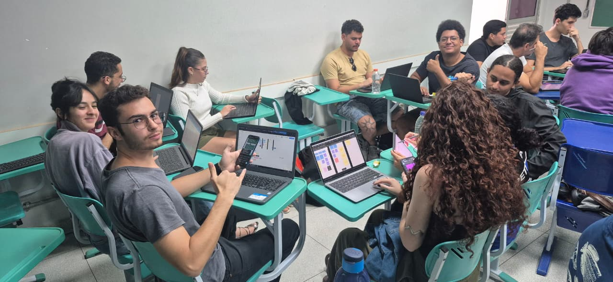
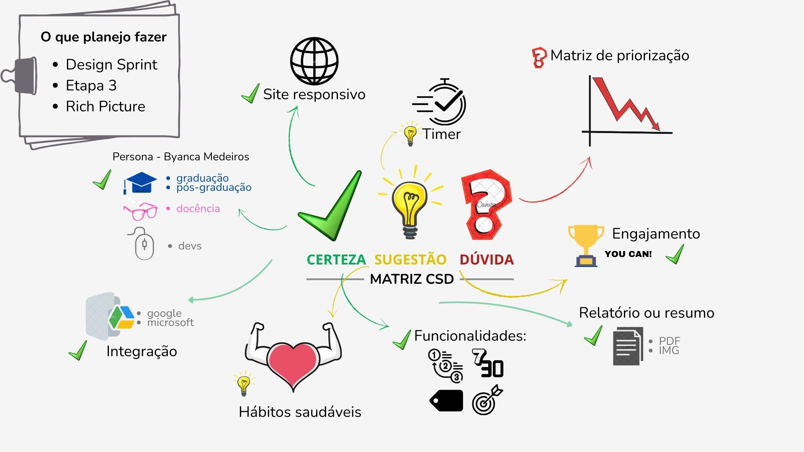
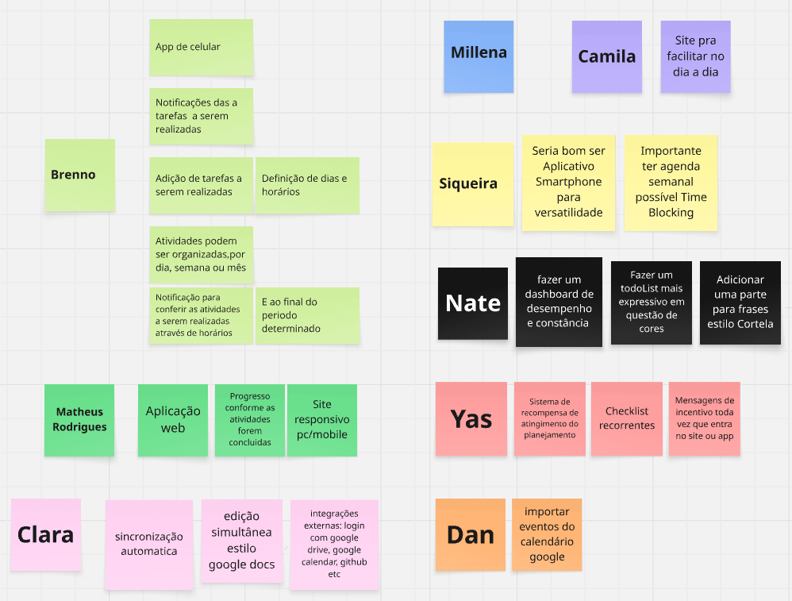

# O Que O Planejo Fazer

**Código da Disciplina**: FGA0208 
**Número do Grupo**: 01 
**Entrega**: 01 

## Alunos

 
  
<table style="width: 100%;">
  <tr>
    <td align="center">
      <a href="https://github.com/Brenno-Silva01">
         
        <b>Brenno Oliveira</b>
      </a>
    </td>
    <td align="center">
      <a href="https://github.com/camilascareli">
         
        <b>Camila Careli</b>
      </a>
    </td>
    <td align="center">
      <a href="https://github.com/DanielCoimbra">
         
        <b>Daniel Coimbra</b>
      </a>
    </td>
    <td align="center">
      <a href="https://github.com/siqueira-prog">
         
        <b>Mateus Siqueira</b>
      </a>
    </td>
    <td align="center">
      <a href="https://github.com/matix0">
         
        <b>Mateus Vinicius</b>
      </a>
    </td>
    <td align="center">
      <a href="https://github.com/mrodrigues14">
         
        <b>Matheus Rodrigues</b>
      </a>
    </td>
    <td align="center">
      <a href="https://github.com/alvezclari">
         
        <b>Maria Clara</b>
      </a>
    </td>
    <td align="center">
      <a href="https://github.com/MillenaQueiroz">
         
        <b>Millena Queiroz</b>
      </a>
    </td>
    <td align="center">
      <a href="https://github.com/nateejpg">
         
        <b>Nathan Abreu</b>
      </a>
    </td>
    <td align="center">
      <a href="https://github.com/yaskisoba">
         
        <b>Yasmin Oliveira</b>
      </a>
    </td>
  </tr>
</table>

## Sobre 
O projeto tem como objetivo desenvolver um planner digital simples e intuitivo, capaz de centralizar atividades pessoais, acadêmicas e profissionais em um só lugar. A proposta é aplicar na prática conteúdos de arquitetura e desenho de software, permitindo documentar e utilizar conceitos técnicos ao longo do desenvolvimento.

Para guiar o desenvolvimento, foi criada a **Lean Persona – Cliente Fictício**: Byanca Medeiros, 23 anos, universitária e estagiária de Engenharia de Software. Ela precisa organizar estudos, estágio e vida pessoal em um só lugar, mas enfrenta dificuldades ao usar vários aplicativos separados e sente que não aproveita bem a semana. O ganho esperado com a solução é um planner digital simples e centralizado, que aumente sua produtividade e facilite a gestão de tempo.

> **Observação:** A Lean Persona detalhada pode ser consultada na seção [Lean Persona](Base/1.2.8.LeanP.md) do projeto.

## Screenshots da Primeira Entrega

Alguns artefatos que encontrará na documentação:

    
    
<em>Imagem 01 - Realização da Design Sprint</em>

---

    
    
<em>Imagem 04 - Rich Picture eleito</em>

--- 

    
    
<em>Imagem 02 - Ideias dos integrantes em Post-its</em>

## Há algo a ser executado?

( ) SIM

(X) NÃO

## Informações Complementares 
> “O maior desafio desta entrega foi coordenar a equipe e garantir a qualidade do que foi desenvolvido.” – Brenno Oliveira.

## Histórico de Versões
| Versão | Alteração | Responsável | Data | Revisor |  Detalhes da Revisão | Data da Revisão |
|--------|-----------|-------------|------|---------|----------------------|-----------------|
| 1.0 | Criação do "Sobre" e referência ao Lean Persona. | [Camila Careli](https://github.com/camilascareli) | 02/09/2025 | [Brenno Oliveira](https://github.com/Brenno-Silva01) | Feito correções ortográficas e adição de imagens.  | 04/09/2025 |